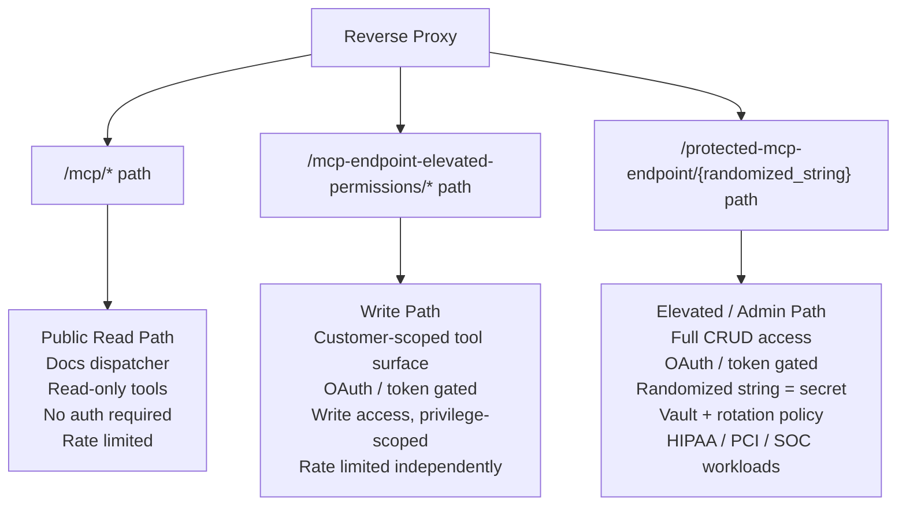

# Security-First MCP Architecture in the Age of Autonomous Agents

---

## The Old Playbook Doesn't Work Anymore

Traditional web security was built around a human attacker operating at human speed. Reconnaissance took days. Lateral movement took weeks. The 2014 Sony breach went undetected for 18 months — not because the attackers were invisible, but because the defenders were operating on human time scales. Detect anomalous behavior, alert, investigate, respond. That loop worked when attackers needed months to do damage.

An autonomous agent doesn't operate at human speed. It operates at API speed.

In two seconds, a compromised or malicious agent can:
- Enumerate your entire tool surface via `tools/list`
- Identify write and admin endpoints by name
- Attempt privilege escalation against any endpoint it can reach
- Exfiltrate everything readable
- Attempt to cover its tracks

The entire attack fits inside your alerting latency. By the time an anomaly detection system fires, the damage is done. The detect-alert-respond loop is not a viable defense against agents.

**The implication is fundamental: security has to be architectural, not reactive. You cannot monitor your way out of a two-second attack window.**

---

## Principle: Least Privilege at the Transport Layer

Most authentication implementations ask: *what is this caller allowed to do?*

That question is answered after the caller is already on the endpoint. A permission check is a software check — and software checks can be bypassed, misconfigured, or exploited. The attack surface is the endpoint itself.

The stronger question is: *can this caller even reach the endpoint where dangerous operations live?*

frisian-mcp's recommended deployment separates read and write operations at the path level:

> Implementation note: This is a recommended architecture, not a default package setting. You must configure path separation explicitly.


### Public read path — docs, discovery, read-only tools
`/mcp/`
This path is for public consumption.  Similar to the path you are reading this on, it is meant to inform agents and be an `open-world` endpoint.  These can still be gated through access tiers and permissions.

This is not a permission boundary. It is a **route-availability boundary**: write and elevated-permission operations are physically absent from the public path. A caller on /mcp/ cannot invoke routes that are not mounted there.

### Write path — customer agent tools with write access.
`/mcp-endpoint-elevated-permissions/`
These paths are similar to the public read path, but include write operations.  This would be where untrusted agents can contribute or mutate customer-scoped states.

### Authenticated write path - elevated admin or sensitive data paths (HIPAA, PCI, SOC, etc...)
`/protected-mcp-endpoint/{randomized_string}`
This path is for administrative permissions on the system, where agents have full CRUD access to the system and data they are responsible for.   If this is internet-facing the `{randomized_string}` should be treated as a `secret` and stored in a vault, with a retention and rotation policy.  This is not authentication and by no means does it replace good authn/authz practices, it is a **defense-in-depth** architectural design suggestion.

A caller on /mcp/ cannot exploit write operations that are not present on /mcp/. There is no write route to invoke, no write permission check to bypass, and no write handler to attack from that surface.

The goal is not to replace authentication. The goal is to make authentication failures less catastrophic by ensuring that low-trust callers can only reach low-risk routes in the first place. Architecture bounds the blast radius before software policy is even evaluated.

---

## Why Permission Checks Alone Are Not Sufficient

Consider a fully authenticated read-tier agent that has been compromised via prompt injection. It has a valid token. It is on the right endpoint. A permission check says: *this token has read access.* It passes. Now the agent attempts a write operation. A permission check says: *this token does not have write access.* It is rejected.

That is the happy path. But:

- The agent now knows write operations exist on this endpoint (the error response told it so)
- The agent knows the schema of the write operation (the error may have leaked it)
- The agent can probe for other operations, variations, edge cases
- Response timing differences between "route not found" and "permission denied" are information

**A permission error is a confirmation that something exists.** Path separation returns nothing — no confirmation, no timing signal, no schema leak.

---

## The Timing Side-Channel

A 404 that resolves in 2ms because the route doesn't exist carries different information than a 403 that resolves in 15ms because the route was found, the handler was invoked, the token was checked, and access was denied.

That 13ms delta tells a probing agent: *this path is live.* The agent doesn't need to succeed. It needs signal. Uniform, fast, uninformative responses from the read path remove the signal entirely.

Recommended: the `/mcp/` path must return identical response shapes and timing for unknown routes regardless of whether anything exists at that path on the write side.

---

## Recommended Deployment Pattern

> The three paths are distinct mounts at the reverse proxy layer — not nested routes. The randomized admin path shares no URL prefix with the write path in production.


For the in-process variant of the open + authenticated pair, set `FRISIAN_MCP_PATH = 'mcp/public'` and `FRISIAN_MCP_PROTECTED_PATH = 'mcp/admin'` (or your chosen names). The protected path's auto-registered view enforces `IsAuthenticated` and uncaps the tier ceiling for authenticated callers; pair with `FRISIAN_MCP_MAX_TIER = 'read'` on the primary path to keep that surface anonymous-read-only regardless of any token presented. The reverse-proxy variant in the diagram remains the right call when you need physical route absence rather than view-level enforcement (e.g. HIPAA/PCI workloads where the elevated path's randomized string is itself a secret).

**What lives on `/mcp/`:**

In frisian-mcp 1.0.11, the **public mount surface is shaped by three package
primitives** — none of them per-path resource allowlists:

- `FRISIAN_MCP_MAX_TIER = 'read'` caps every caller hitting the primary mount
  to the `read` tier, so every `create` / `update` / `destroy` action is hidden
  from `tools/list`.  Read-only `list` and `retrieve` actions remain visible.
- `@mcp_ignore` on a ViewSet class or action method hides that target from
  auto-discovery across **all** mounts in the process.  Use it to keep
  internal or UI-oriented ViewSets out of the MCP surface entirely.
- Group-scoped documentation dispatcher: the docs dispatcher returns only
  documents in the Django group(s) you mark public, so launching a new
  guide is a group reassignment rather than a deployment.

> **Limitation in 1.0.11.** There is no per-mount tool allowlist in the
> package today — `FRISIAN_MCP_TOOL_ALLOWLIST` and `FRISIAN_MCP_TOOL_DENYLIST`
> are applied once at startup and affect every mount equally.  If your
> deployment needs "expose hand-picked read-only resource A on `/mcp/`, full
> CRUD on `/mcp-protected/`", reach for the reverse-proxy variant in the
> diagram above or `@mcp_ignore` the resources you don't want on either mount.
> Per-mount resource scoping is a deferred enhancement; track operator demand
> in the [Roadmap](../roadmap.md).

**What lives on `/mcp-endpoint-elevated-permissions/`:**

The `FRISIAN_MCP_PROTECTED_PATH` auto-registered mount runs the same tool
surface as the primary mount but with `IsAuthenticated` enforced and the
tier ceiling uncapped — authenticated callers reach the full
`read` / `read_write` / `admin` surface they're entitled to, gated by their
token's permission tier (frisian-mcp static token, OAuth-issued access token,
or settings-backed API key).

**What lives on `/protected-mcp-endpoint/`:**

The reverse-proxy-only variant.  Use a randomized path string that the
proxy routes to a third frisian-mcp mount (or a different process entirely),
where the randomized string itself is the access secret.  Appropriate when
you need *physical route absence* on the open mount — HIPAA / PCI / SOC
workloads where merely knowing the URL grants entry, and view-level
`IsAuthenticated` enforcement is not enough.  Per-agent tool scoping on this
mount is configured at the authentication layer (token tier + the same
package primitives above), not via a per-path allowlist.

---

## Group-Scoped Document Visibility

Not all documentation should be public simultaneously. frisian-mcp uses Django group assignment to control which documents are served by the docs dispatcher.

```
private group  →  not returned by /mcp/ docs dispatcher
public group   →  returned with no authentication required
```

This means launching new documentation — install guides, troubleshooting docs, platform-specific guides — is a single group reassignment, not a deployment. The content exists and is RAG-indexed before it is ever exposed. Going live is a switch flip.

Documents that should never be public (internal runbooks, demo environment configs, agent orchestration docs) remain in the private group indefinitely.

---

## Rate Limiting

The read path should be rate limited independently from the write path. A malicious agent hammering `/mcp/`, or even `/mcp-endpoint-elevated-permissions/` for enumeration or denial-of-service purposes should not affect authenticated agents operating on `/protected-mcp-endpoint/`.

frisian-mcp includes `RateLimitMiddleware` — a sliding-window rate limiter requiring no external dependency (no Redis). Configure independently per path.

---

## Forward-Looking: Agents Are Getting Smarter

The threat model described here is not hypothetical. Prompt injection attacks against agents are documented and increasing. Supply chain attacks targeting agent tool surfaces are an emerging vector. Jailbroken agents that ignore their system prompt constraints exist today.

The assumption that an agent on your network is behaving as intended is not a safe assumption. The question is not *will* a bad actor attempt to use an agent against your infrastructure — it is *when*, and *how much damage can they do in the window before detection*.

Path separation, permission-scoped tool surfaces, and architectural least privilege are not paranoia. They are the minimum viable security posture for production MCP deployments in 2025 and beyond.

> **Build security first.**  
> Not because it was required.  
> Because by the time it becomes required, it is already too late.

---

## Summary Checklist

- [ ] Read path (`/mcp/`) and write paths (`/mcp-endpoint-elevated-permissions/` and `/protected-mcp-endpoint/`) separated at the routing layer
- [ ] Write operations do not exist on the read path — not gated, absent
- [ ] Public docs assigned to a group; group reassignment controls visibility
- [ ] Rate limiting configured independently per path
- [ ] Authentication required on write path (OAuth 2.0 or static token)
- [ ] Per-agent tool scoping configured at the authentication layer
- [ ] Timing responses on read path are uniform for unknown routes
- [ ] Coding agents consuming your MCP surface are explicitly told about both paths

---

*This document is part of the frisian-mcp documentation framework. For install guides see the `install` dispatcher on this server.*
