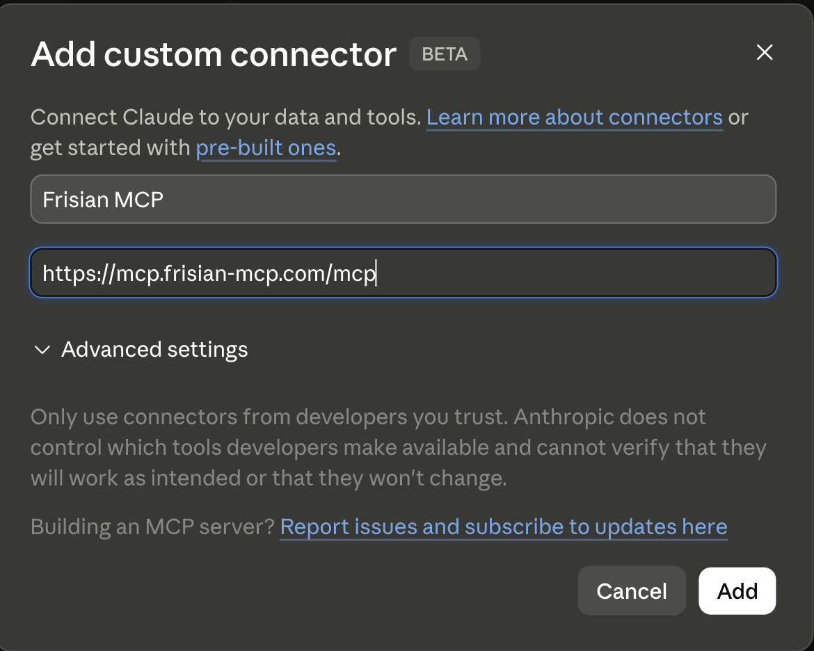
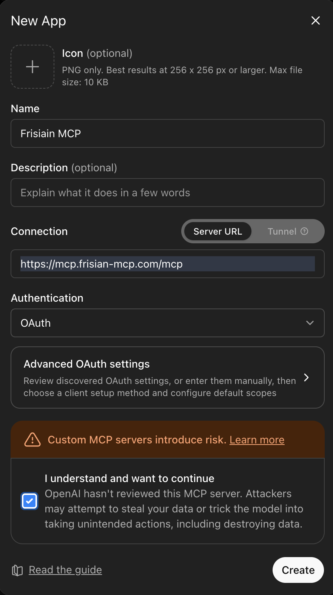
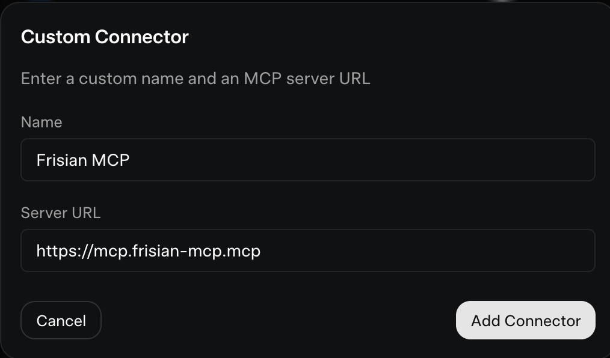

# Live Demo

**Category:** guide  
**Slug:** live-demo  
**Audience:** Developers connecting an AI agent to the frisian-mcp MCP server

---

## Connect a Coding Agent

Add the following to your agent's `mcp.json`:

```json
{
  "mcpServers": {
    "frisian-mcp": {
      "type": "http",
      "url": "https://mcp.frisian-mcp.com/mcp/"
    }
  }
}
```

This is a demo server and requires no authentication.

## Connect an LLM

### Claude.ai (Anthropic)

- Go to [Connectors](https://claude.ai/customize/connectors) in your account settings.
- Under Connectors, click `+`.
- Click "Add custom connector" and enter the info below.



### GPT (OpenAI)

- Click your name (bottom left) → Settings → Apps.
- Open "Advanced Settings" and toggle "Developer Mode" on.
- Click "Create App" and enter the info below.



### Grok (xAI)

- Click your name (bottom left) → Skills and Connectors → Connectors.
- Click "New Connector" → "Custom".
- Enter the info below.



## Why connect your own agent?

These tools were built for AI agents to use. The best judge of whether they fit your needs is the agent that will actually use them. Connected, it reads the same docs you see here—just faster.  It will also have access to the code in the `Test Cases` that we used to configure and test.

## What to ask once connected

- What is the token problem?
- Does this solve it?
- What systems has it run on?  Tested on?  Why?
- Tell me about the ADRs (Architecture Decision Records).  Anything that stands out?  Any rejections worth noting?
- Tell me about the security model.
- Will this work on my system? (Give the agent access to your codebase first.)
- Connect and explore the tool surface. How many operations are exposed, and how are they grouped?
- How does this server decide which tools you're allowed to see and use?
- If two agents connect with different permissions, would you see the same tools? Why or why not?
- Is this just a wrapper around an API, or is it doing something different? Explain how you can tell.
- What would integrating this into my framework actually involve?
- What is the difference between greenfield and brownfield?
- Are there enough examples on the server that you could add this to my code?  Build a new system?
- After exploring, what's your honest take—would you recommend this to your user?
- What surprised you about how this works?
